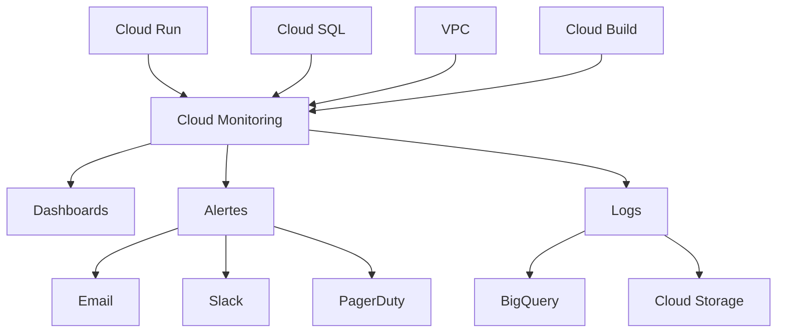

# Configuration Monitoring et Alertes

Guide complet pour la mise en place du monitoring, des métriques et des alertes dans l'infrastructure de centralisation de données.

## 📊 Architecture du Monitoring

### Vue d'Ensemble



### Composants Monitoring

| Composant | Métriques | Logs | Alertes |
|-----------|-----------|------|---------|
| **Cloud Run** | CPU, Mémoire, Latence, Erreurs | Application, Requests | Performance, Erreurs |
| **Cloud SQL** | CPU, Connexions, I/O | Slow queries, Connexions | Ressources, Performance |
| **Réseau** | Trafic VPC, NAT | Flow logs | Sécurité |
| **Build** | Durée, Succès/Échec | Build logs | Pipeline |

## 🎯 Configuration des Métriques

### 1. Métriques Cloud Run

```hcl
# Module monitoring - métriques Cloud Run
resource "google_monitoring_alert_policy" "cloud_run_cpu_high" {
  display_name = "${var.environment} - Cloud Run CPU élevé"
  combiner     = "OR"
  
  conditions {
    display_name = "CPU utilization > 80%"
    
    condition_threshold {
      filter         = "resource.type=\"cloud_run_revision\" AND resource.labels.service_name=\"${var.service_name}\""
      comparison     = "COMPARISON_GREATER_THAN"
      threshold_value = 0.8
      duration       = "300s"
      
      aggregations {
        alignment_period     = "60s"
        per_series_aligner  = "ALIGN_MEAN"
        cross_series_reducer = "REDUCE_MEAN"
        group_by_fields     = ["resource.labels.service_name"]
      }
    }
  }
  
  notification_channels = var.notification_channels
  alert_strategy {
    auto_close = "1800s"
  }
}

resource "google_monitoring_alert_policy" "cloud_run_memory_high" {
  display_name = "${var.environment} - Cloud Run Mémoire élevée"
  
  conditions {
    display_name = "Memory utilization > 90%"
    
    condition_threshold {
      filter         = "resource.type=\"cloud_run_revision\" AND metric.type=\"run.googleapis.com/container/memory/utilizations\""
      comparison     = "COMPARISON_GREATER_THAN"
      threshold_value = 0.9
      duration       = "300s"
      
      aggregations {
        alignment_period     = "60s"
        per_series_aligner  = "ALIGN_MEAN"
      }
    }
  }
  
  notification_channels = var.notification_channels
}

resource "google_monitoring_alert_policy" "cloud_run_request_latency" {
  display_name = "${var.environment} - Cloud Run Latence élevée"
  
  conditions {
    display_name = "Request latency > 2s"
    
    condition_threshold {
      filter         = "resource.type=\"cloud_run_revision\" AND metric.type=\"run.googleapis.com/request_latencies\""
      comparison     = "COMPARISON_GREATER_THAN"
      threshold_value = 2000
      duration       = "300s"
      
      aggregations {
        alignment_period     = "60s"
        per_series_aligner  = "ALIGN_DELTA"
        cross_series_reducer = "REDUCE_PERCENTILE_95"
      }
    }
  }
  
  notification_channels = var.notification_channels
}

resource "google_monitoring_alert_policy" "cloud_run_error_rate" {
  display_name = "${var.environment} - Cloud Run Taux d'erreur élevé"
  
  conditions {
    display_name = "Error rate > 5%"
    
    condition_threshold {
      filter = join(" AND ", [
        "resource.type=\"cloud_run_revision\"",
        "metric.type=\"run.googleapis.com/request_count\"",
        "metric.labels.response_code_class=\"5xx\""
      ])
      comparison     = "COMPARISON_GREATER_THAN"
      threshold_value = 0.05
      duration       = "300s"
      
      aggregations {
        alignment_period     = "60s"
        per_series_aligner  = "ALIGN_RATE"
        cross_series_reducer = "REDUCE_SUM"
      }
    }
  }
  
  notification_channels = var.notification_channels
}
```

### 2. Métriques Cloud SQL

```hcl
resource "google_monitoring_alert_policy" "cloudsql_cpu_high" {
  display_name = "${var.environment} - Cloud SQL CPU élevé"
  
  conditions {
    display_name = "Database CPU > 80%"
    
    condition_threshold {
      filter         = "resource.type=\"cloudsql_database\" AND metric.type=\"cloudsql.googleapis.com/database/cpu/utilization\""
      comparison     = "COMPARISON_GREATER_THAN"
      threshold_value = 0.8
      duration       = "300s"
      
      aggregations {
        alignment_period     = "60s"
        per_series_aligner  = "ALIGN_MEAN"
      }
    }
  }
  
  notification_channels = var.notification_channels
}

resource "google_monitoring_alert_policy" "cloudsql_memory_high" {
  display_name = "${var.environment} - Cloud SQL Mémoire élevée"
  
  conditions {
    display_name = "Database Memory > 90%"
    
    condition_threshold {
      filter         = "resource.type=\"cloudsql_database\" AND metric.type=\"cloudsql.googleapis.com/database/memory/utilization\""
      comparison     = "COMPARISON_GREATER_THAN"
      threshold_value = 0.9
      duration       = "300s"
      
      aggregations {
        alignment_period     = "60s"
        per_series_aligner  = "ALIGN_MEAN"
      }
    }
  }
  
  notification_channels = var.notification_channels
}

resource "google_monitoring_alert_policy" "cloudsql_connections_high" {
  display_name = "${var.environment} - Cloud SQL Connexions élevées"
  
  conditions {
    display_name = "Active connections > 80% of max"
    
    condition_threshold {
      filter         = "resource.type=\"cloudsql_database\" AND metric.type=\"cloudsql.googleapis.com/database/postgresql/num_backends\""
      comparison     = "COMPARISON_GREATER_THAN"
      threshold_value = var.environment == "prod" ? 80 : 40
      duration       = "300s"
      
      aggregations {
        alignment_period     = "60s"
        per_series_aligner  = "ALIGN_MEAN"
      }
    }
  }
  
  notification_channels = var.notification_channels
}

resource "google_monitoring_alert_policy" "cloudsql_disk_usage" {
  display_name = "${var.environment} - Cloud SQL Espace disque"
  
  conditions {
    display_name = "Disk usage > 85%"
    
    condition_threshold {
      filter         = "resource.type=\"cloudsql_database\" AND metric.type=\"cloudsql.googleapis.com/database/disk/utilization\""
      comparison     = "COMPARISON_GREATER_THAN"
      threshold_value = 0.85
      duration       = "300s"
      
      aggregations {
        alignment_period     = "60s"
        per_series_aligner  = "ALIGN_MEAN"
      }
    }
  }
  
  notification_channels = var.notification_channels
}
```

### 3. Métriques Réseau

```hcl
resource "google_monitoring_alert_policy" "vpc_firewall_blocked" {
  display_name = "${var.environment} - Trafic bloqué par firewall"
  
  conditions {
    display_name = "Blocked connections > 10/min"
    
    condition_threshold {
      filter = join(" AND ", [
        "resource.type=\"gce_subnetwork\"",
        "metric.type=\"compute.googleapis.com/firewall/dropped_packets_count\"",
        "resource.labels.subnetwork_name=~\"${var.environment}-.*\""
      ])
      comparison     = "COMPARISON_GREATER_THAN"
      threshold_value = 10
      duration       = "300s"
      
      aggregations {
        alignment_period     = "60s"
        per_series_aligner  = "ALIGN_RATE"
        cross_series_reducer = "REDUCE_SUM"
      }
    }
  }
  
  notification_channels = var.notification_channels
}

resource "google_monitoring_alert_policy" "nat_gateway_errors" {
  display_name = "${var.environment} - Erreurs NAT Gateway"
  
  conditions {
    display_name = "NAT allocation errors"
    
    condition_threshold {
      filter         = "resource.type=\"nat_gateway\" AND metric.type=\"router.googleapis.com/nat/port_allocation_failure_count\""
      comparison     = "COMPARISON_GREATER_THAN"
      threshold_value = 0
      duration       = "60s"
      
      aggregations {
        alignment_period     = "60s"
        per_series_aligner  = "ALIGN_RATE"
      }
    }
  }
  
  notification_channels = var.notification_channels
}
```

## 📈 Dashboards Cloud Monitoring

### 1. Dashboard Principal

```hcl
resource "google_monitoring_dashboard" "main_dashboard" {
  dashboard_json = jsonencode({
    displayName = "Infrastructure - ${var.environment}"
    mosaicLayout = {
      tiles = [
        {
          width = 6
          height = 4
          widget = {
            title = "Cloud Run - CPU Utilization"
            xyChart = {
              dataSets = [{
                timeSeriesQuery = {
                  timeSeriesFilter = {
                    filter = "resource.type=\"cloud_run_revision\" AND metric.type=\"run.googleapis.com/container/cpu/utilizations\""
                    aggregation = {
                      alignmentPeriod = "60s"
                      perSeriesAligner = "ALIGN_MEAN"
                      crossSeriesReducer = "REDUCE_MEAN"
                      groupByFields = ["resource.labels.service_name"]
                    }
                  }
                }
                plotType = "LINE"
                targetAxis = "Y1"
              }]
              yAxis = {
                label = "CPU Utilization"
                scale = "LINEAR"
              }
            }
          }
        },
        {
          width = 6
          height = 4
          widget = {
            title = "Cloud Run - Memory Utilization"
            xyChart = {
              dataSets = [{
                timeSeriesQuery = {
                  timeSeriesFilter = {
                    filter = "resource.type=\"cloud_run_revision\" AND metric.type=\"run.googleapis.com/container/memory/utilizations\""
                    aggregation = {
                      alignmentPeriod = "60s"
                      perSeriesAligner = "ALIGN_MEAN"
                      crossSeriesReducer = "REDUCE_MEAN"
                      groupByFields = ["resource.labels.service_name"]
                    }
                  }
                }
                plotType = "LINE"
                targetAxis = "Y1"
              }]
            }
          }
        },
        {
          width = 6
          height = 4
          widget = {
            title = "Cloud Run - Request Count"
            xyChart = {
              dataSets = [{
                timeSeriesQuery = {
                  timeSeriesFilter = {
                    filter = "resource.type=\"cloud_run_revision\" AND metric.type=\"run.googleapis.com/request_count\""
                    aggregation = {
                      alignmentPeriod = "60s"
                      perSeriesAligner = "ALIGN_RATE"
                      crossSeriesReducer = "REDUCE_SUM"
                    }
                  }
                }
                plotType = "LINE"
              }]
            }
          }
        },
        {
          width = 6
          height = 4
          widget = {
            title = "Cloud Run - Request Latency (95th percentile)"
            xyChart = {
              dataSets = [{
                timeSeriesQuery = {
                  timeSeriesFilter = {
                    filter = "resource.type=\"cloud_run_revision\" AND metric.type=\"run.googleapis.com/request_latencies\""
                    aggregation = {
                      alignmentPeriod = "60s"
                      perSeriesAligner = "ALIGN_DELTA"
                      crossSeriesReducer = "REDUCE_PERCENTILE_95"
                    }
                  }
                }
                plotType = "LINE"
              }]
            }
          }
        }
      ]
    }
  })
}
```

### 2. Dashboard Cloud SQL

```hcl
resource "google_monitoring_dashboard" "database_dashboard" {
  dashboard_json = jsonencode({
    displayName = "Database - ${var.environment}"
    mosaicLayout = {
      tiles = [
        {
          width = 6
          height = 4
          widget = {
            title = "Cloud SQL - CPU Utilization"
            xyChart = {
              dataSets = [{
                timeSeriesQuery = {
                  timeSeriesFilter = {
                    filter = "resource.type=\"cloudsql_database\" AND metric.type=\"cloudsql.googleapis.com/database/cpu/utilization\""
                    aggregation = {
                      alignmentPeriod = "60s"
                      perSeriesAligner = "ALIGN_MEAN"
                    }
                  }
                }
                plotType = "LINE"
              }]
            }
          }
        },
        {
          width = 6
          height = 4
          widget = {
            title = "Cloud SQL - Active Connections"
            xyChart = {
              dataSets = [{
                timeSeriesQuery = {
                  timeSeriesFilter = {
                    filter = "resource.type=\"cloudsql_database\" AND metric.type=\"cloudsql.googleapis.com/database/postgresql/num_backends\""
                    aggregation = {
                      alignmentPeriod = "60s"
                      perSeriesAligner = "ALIGN_MEAN"
                    }
                  }
                }
                plotType = "LINE"
              }]
            }
          }
        },
        {
          width = 12
          height = 4
          widget = {
            title = "Cloud SQL - Disk Usage"
            xyChart = {
              dataSets = [
                {
                  timeSeriesQuery = {
                    timeSeriesFilter = {
                      filter = "resource.type=\"cloudsql_database\" AND metric.type=\"cloudsql.googleapis.com/database/disk/bytes_used\""
                      aggregation = {
                        alignmentPeriod = "60s"
                        perSeriesAligner = "ALIGN_MEAN"
                      }
                    }
                  }
                  plotType = "LINE"
                  targetAxis = "Y1"
                },
                {
                  timeSeriesQuery = {
                    timeSeriesFilter = {
                      filter = "resource.type=\"cloudsql_database\" AND metric.type=\"cloudsql.googleapis.com/database/disk/quota\""
                      aggregation = {
                        alignmentPeriod = "60s"
                        perSeriesAligner = "ALIGN_MEAN"
                      }
                    }
                  }
                  plotType = "LINE"
                  targetAxis = "Y1"
                }
              ]
            }
          }
        }
      ]
    }
  })
}
```

## 🔔 Configuration des Alertes

### 1. Canaux de Notification

```hcl
# Email
resource "google_monitoring_notification_channel" "email" {
  display_name = "Email Alerts - ${var.environment}"
  type         = "email"
  
  labels = {
    email_address = var.alert_email
  }
  
  enabled = true
}

# Slack (si configuré)
resource "google_monitoring_notification_channel" "slack" {
  count        = var.slack_webhook_url != "" ? 1 : 0
  display_name = "Slack Alerts - ${var.environment}"
  type         = "slack"
  
  labels = {
    url = var.slack_webhook_url
  }
  
  enabled = true
}

# SMS (si configuré)
resource "google_monitoring_notification_channel" "sms" {
  count        = var.sms_number != "" ? 1 : 0
  display_name = "SMS Alerts - ${var.environment}"
  type         = "sms"
  
  labels = {
    number = var.sms_number
  }
  
  enabled = true
}
```

### 2. Groupes d'Alertes par Criticité

```hcl
# Alertes critiques (production uniquement)
locals {
  critical_notification_channels = var.environment == "prod" ? [
    google_monitoring_notification_channel.email.name,
    try(google_monitoring_notification_channel.slack[0].name, ""),
    try(google_monitoring_notification_channel.sms[0].name, "")
  ] : [
    google_monitoring_notification_channel.email.name
  ]
  
  warning_notification_channels = [
    google_monitoring_notification_channel.email.name,
    try(google_monitoring_notification_channel.slack[0].name, "")
  ]
}

# Politique d'alerte pour panne complète
resource "google_monitoring_alert_policy" "service_down" {
  display_name = "${var.environment} - Service Indisponible"
  combiner     = "OR"
  enabled      = true
  
  conditions {
    display_name = "Service health check failed"
    
    condition_threshold {
      filter         = "resource.type=\"uptime_url\""
      comparison     = "COMPARISON_GREATER_THAN"
      threshold_value = 1
      duration       = "120s"
      
      aggregations {
        alignment_period     = "60s"
        per_series_aligner  = "ALIGN_NEXT_OLDER"
        cross_series_reducer = "REDUCE_COUNT_FALSE"
      }
    }
  }
  
  notification_channels = local.critical_notification_channels
  
  alert_strategy {
    auto_close = "1800s"
    
    notification_rate_limit {
      period = "300s"
    }
  }
}
```

## 📋 Uptime Monitoring

### 1. Health Checks

```hcl
resource "google_monitoring_uptime_check_config" "health_check" {
  display_name = "${var.environment} - Health Check"
  timeout      = "10s"
  period       = "60s"
  
  http_check {
    path         = "/actuator/health"
    port         = "443"
    use_ssl      = true
    validate_ssl = true
  }
  
  monitored_resource {
    type = "uptime_url"
    labels = {
      project_id = var.project_id
      host       = var.service_url
    }
  }
  
  content_matchers {
    content = "UP"
    matcher = "CONTAINS_STRING"
  }
  
  checker_type = "STATIC_IP_CHECKERS"
  
  selected_regions = [
    "EUROPE",
    "USA"
  ]
}

resource "google_monitoring_uptime_check_config" "api_endpoint" {
  display_name = "${var.environment} - API Endpoint"
  timeout      = "10s"
  period       = "300s"
  
  http_check {
    path         = "/api/data"
    port         = "443"
    use_ssl      = true
    validate_ssl = true
    
    headers = {
      "Accept" = "application/json"
    }
  }
  
  monitored_resource {
    type = "uptime_url"
    labels = {
      project_id = var.project_id
      host       = var.service_url
    }
  }
  
  content_matchers {
    content = "200"
    matcher = "STATUS_EQUALS"
  }
  
  checker_type = "STATIC_IP_CHECKERS"
  
  selected_regions = ["EUROPE"]
}
```

### 2. Alertes Uptime

```hcl
resource "google_monitoring_alert_policy" "uptime_alert" {
  display_name = "${var.environment} - Service Down"
  
  conditions {
    display_name = "Uptime check failed"
    
    condition_threshold {
      filter         = "metric.type=\"monitoring.googleapis.com/uptime_check/check_passed\" AND metric.labels.check_id=\"${google_monitoring_uptime_check_config.health_check.uptime_check_id}\""
      comparison     = "COMPARISON_EQUAL"
      threshold_value = 0
      duration       = "120s"
      
      aggregations {
        alignment_period     = "1200s"
        per_series_aligner  = "ALIGN_NEXT_OLDER"
        cross_series_reducer = "REDUCE_COUNT_FALSE"
        group_by_fields     = ["resource.*"]
      }
      
      trigger {
        count = 1
      }
    }
  }
  
  notification_channels = local.critical_notification_channels
}
```

## 📊 Logs et Audit

### 1. Configuration des Logs

```hcl
# Sink pour BigQuery (analyse)
resource "google_logging_project_sink" "bigquery_sink" {
  name        = "${var.environment}-logs-to-bigquery"
  destination = "bigquery.googleapis.com/projects/${var.project_id}/datasets/${google_bigquery_dataset.logs.dataset_id}"
  
  filter = join(" OR ", [
    "resource.type=\"cloud_run_revision\"",
    "resource.type=\"cloudsql_database\"",
    "resource.type=\"gce_subnetwork\""
  ])
  
  unique_writer_identity = true
  bigquery_options {
    use_partitioned_tables = true
  }
}

# Sink pour Cloud Storage (archivage)
resource "google_logging_project_sink" "storage_sink" {
  name        = "${var.environment}-logs-to-storage"
  destination = "storage.googleapis.com/${google_storage_bucket.logs.name}"
  
  filter = join(" AND ", [
    "timestamp >= \"${formatdate("YYYY-MM-DD", timeadd(timestamp(), "-7d"))}\"",
    "severity >= ERROR"
  ])
  
  unique_writer_identity = true
}

# Dataset BigQuery pour les logs
resource "google_bigquery_dataset" "logs" {
  dataset_id                 = "${var.environment}_logs"
  friendly_name             = "Application Logs - ${var.environment}"
  description               = "Logs applicatifs pour analyse"
  location                  = var.region
  
  default_table_expiration_ms = 2592000000 # 30 jours
  
  labels = var.labels
}

# Bucket Cloud Storage pour archivage
resource "google_storage_bucket" "logs" {
  name          = "${var.project_id}-${var.environment}-logs-archive"
  location      = var.region
  force_destroy = var.environment != "prod"
  
  lifecycle_rule {
    condition {
      age = 90
    }
    action {
      type = "Delete"
    }
  }
  
  lifecycle_rule {
    condition {
      age = 30
    }
    action {
      type          = "SetStorageClass"
      storage_class = "COLDLINE"
    }
  }
  
  labels = var.labels
}
```

### 2. Alertes sur les Logs

```hcl
# Alerte sur les erreurs applicatives
resource "google_monitoring_alert_policy" "application_errors" {
  display_name = "${var.environment} - Erreurs Application"
  
  conditions {
    display_name = "High error rate in logs"
    
    condition_threshold {
      filter = join(" AND ", [
        "resource.type=\"cloud_run_revision\"",
        "severity >= ERROR",
        "resource.labels.service_name=\"${var.service_name}\""
      ])
      comparison     = "COMPARISON_GREATER_THAN"
      threshold_value = var.environment == "prod" ? 5 : 10
      duration       = "300s"
      
      aggregations {
        alignment_period     = "60s"
        per_series_aligner  = "ALIGN_RATE"
        cross_series_reducer = "REDUCE_SUM"
      }
    }
  }
  
  notification_channels = local.warning_notification_channels
}

# Alerte sur les logs de sécurité
resource "google_monitoring_alert_policy" "security_events" {
  display_name = "${var.environment} - Événements Sécurité"
  
  conditions {
    display_name = "Security-related log entries"
    
    condition_threshold {
      filter = join(" AND ", [
        "protoPayload.authenticationInfo.principalEmail!=\"\"",
        "protoPayload.methodName:(\"google.iam\" OR \"google.compute.firewalls\")",
        "severity >= WARNING"
      ])
      comparison     = "COMPARISON_GREATER_THAN"
      threshold_value = 0
      duration       = "0s"
      
      aggregations {
        alignment_period     = "60s"
        per_series_aligner  = "ALIGN_RATE"
        cross_series_reducer = "REDUCE_SUM"
      }
    }
  }
  
  notification_channels = local.critical_notification_channels
}
```

## 💰 Budget et Coûts

### 1. Alertes Budget

```hcl
resource "google_billing_budget" "project_budget" {
  billing_account = var.billing_account_id
  display_name    = "Budget ${var.environment}"
  
  budget_filter {
    projects = ["projects/${var.project_id}"]
    services = [
      "services/24E6-581D-38E5", # Compute Engine
      "services/95FF-2EF5-5EA1", # Cloud SQL
      "services/F25A-9A26-6F04", # Cloud Run
      "services/5490-E99C-A7C8"  # Cloud Monitoring
    ]
    
    labels = {
      environment = [var.environment]
    }
  }
  
  amount {
    specified_amount {
      currency_code = "EUR"
      units         = var.budget_amount
    }
  }
  
  threshold_rules {
    threshold_percent = 0.5
    spend_basis      = "CURRENT_SPEND"
  }
  
  threshold_rules {
    threshold_percent = 0.8
    spend_basis      = "CURRENT_SPEND"
  }
  
  threshold_rules {
    threshold_percent = 1.0
    spend_basis      = "CURRENT_SPEND"
  }
  
  all_updates_rule {
    monitoring_notification_channels = [
      google_monitoring_notification_channel.email.name
    ]
    
    disable_default_iam_recipients = false
  }
}
```

## 🔧 Scripts de Monitoring

### 1. Script de Vérification de Santé

```bash
#!/bin/bash
# scripts/health-check.sh

set -euo pipefail

ENVIRONMENT=${1:-dev}
PROJECT_ID=${2:-your-project-id}

echo "🏥 Vérification de la santé de l'environnement $ENVIRONMENT"

# Vérification Cloud Run
echo "📦 Vérification Cloud Run..."
SERVICE_NAME="data-centralization-${ENVIRONMENT}-service"
SERVICE_URL=$(gcloud run services describe $SERVICE_NAME \
  --region=europe-west1 \
  --format="value(status.url)")

if curl -sf "$SERVICE_URL/actuator/health" | grep -q "UP"; then
  echo "✅ Cloud Run: Service opérationnel"
else
  echo "❌ Cloud Run: Service en erreur"
  exit 1
fi

# Vérification Cloud SQL
echo "🗄️ Vérification Cloud SQL..."
INSTANCE_NAME="${ENVIRONMENT}-postgres-instance"
INSTANCE_STATE=$(gcloud sql instances describe $INSTANCE_NAME \
  --format="value(state)")

if [ "$INSTANCE_STATE" = "RUNNABLE" ]; then
  echo "✅ Cloud SQL: Instance opérationnelle"
else
  echo "❌ Cloud SQL: Instance en erreur ($INSTANCE_STATE)"
  exit 1
fi

# Vérification métriques
echo "📊 Vérification des dernières métriques..."
CPU_USAGE=$(gcloud monitoring metrics list \
  --filter="resource.type=cloud_run_revision AND metric.type=run.googleapis.com/container/cpu/utilizations" \
  --limit=1 \
  --format="value(points[0].value.doubleValue)")

if (( $(echo "$CPU_USAGE < 0.9" | bc -l) )); then
  echo "✅ CPU Usage: ${CPU_USAGE}% (OK)"
else
  echo "⚠️ CPU Usage: ${CPU_USAGE}% (Élevé)"
fi

echo "🎉 Vérification terminée avec succès"
```

### 2. Script de Génération de Rapport

```bash
#!/bin/bash
# scripts/monitoring-report.sh

set -euo pipefail

ENVIRONMENT=${1:-dev}
DAYS=${2:-7}

echo "📊 Génération du rapport monitoring pour $ENVIRONMENT (derniers $DAYS jours)"

# Métriques Cloud Run
echo "## Cloud Run Metrics" > report.md
gcloud logging read "resource.type=cloud_run_revision AND timestamp>=\"$(date -d "$DAYS days ago" -Iseconds)\"" \
  --format="table(timestamp,httpRequest.requestMethod,httpRequest.status,httpRequest.latency)" \
  --limit=100 >> report.md

# Métriques Cloud SQL
echo "## Cloud SQL Metrics" >> report.md
gcloud logging read "resource.type=cloudsql_database AND timestamp>=\"$(date -d "$DAYS days ago" -Iseconds)\"" \
  --format="table(timestamp,severity,textPayload)" \
  --limit=50 >> report.md

# Alertes déclenchées
echo "## Alertes Déclenchées" >> report.md
gcloud alpha monitoring incidents list \
  --format="table(name,state,summary)" >> report.md

echo "📝 Rapport généré: report.md"
```

## 📚 Commandes Utiles

### Consultation des Métriques

```bash
# CPU Cloud Run
gcloud monitoring metrics list \
  --filter="resource.type=cloud_run_revision AND metric.type=run.googleapis.com/container/cpu/utilizations"

# Mémoire Cloud Run  
gcloud monitoring metrics list \
  --filter="resource.type=cloud_run_revision AND metric.type=run.googleapis.com/container/memory/utilizations"

# Requêtes par minute
gcloud monitoring metrics list \
  --filter="resource.type=cloud_run_revision AND metric.type=run.googleapis.com/request_count"

# Latence 95e percentile
gcloud monitoring metrics list \
  --filter="resource.type=cloud_run_revision AND metric.type=run.googleapis.com/request_latencies"
```

### Gestion des Alertes

```bash
# Lister les politiques d'alerte
gcloud alpha monitoring policies list

# Activer/désactiver une alerte
gcloud alpha monitoring policies update POLICY_ID --enabled

# Tester une notification
gcloud alpha monitoring channels verify CHANNEL_ID
```

### Analyse des Logs

```bash
# Erreurs des dernières 24h
gcloud logging read "severity>=ERROR AND timestamp>=\"$(date -d '1 day ago' -Iseconds)\""

# Requêtes lentes (>2s)
gcloud logging read "httpRequest.latency>\"2s\" AND timestamp>=\"$(date -d '1 hour ago' -Iseconds)\""

# Logs par utilisateur
gcloud logging read "protoPayload.authenticationInfo.principalEmail=\"user@example.com\""
```

## 📚 Ressources Complémentaires

- [Documentation Cloud Monitoring](https://cloud.google.com/monitoring/docs)
- [Alertes Cloud Monitoring](https://cloud.google.com/monitoring/alerts)
- [Dashboards Cloud Monitoring](https://cloud.google.com/monitoring/dashboards)
- [Cloud Logging](https://cloud.google.com/logging/docs)
- [Uptime Monitoring](https://cloud.google.com/monitoring/uptime-checks) 