# Sécurité et Bonnes Pratiques

Guide complet pour la sécurité et les bonnes pratiques dans l'infrastructure de centralisation de données sur Google Cloud Platform.

## 🛡️ Architecture de Sécurité

### Vue d'Ensemble

```mermaid
graph TB
    A[Internet] --> B[Cloud Load Balancer]
    B --> C[Cloud Run Service]
    C --> D[VPC Connector]
    D --> E[Private VPC]
    E --> F[Cloud SQL Private IP]
    
    G[Cloud IAM] --> C
    G --> F
    
    H[Secret Manager] --> C
    I[Workload Identity] --> C
    
    J[Cloud Armor] --> B
    K[Certificate Manager] --> B
    
    L[Cloud Audit Logs] --> M[BigQuery]
    N[Cloud Monitoring] --> O[Alertes Sécurité]
```



### Principes de Sécurité

| Principe | Implémentation | Contrôle |
|----------|----------------|----------|
| **Moindre Privilège** | IAM Rôles minimaux | Audit régulier |
| **Défense en Profondeur** | Multiples couches sécuritaires | Tests de pénétration |
| **Chiffrement** | Données en transit et au repos | Rotation des clés |
| **Monitoring** | Logs d'audit complets | Alertes temps réel |
| **Isolation** | Réseaux privés | Segmentation |

## 🔐 Gestion des Identités et Accès (IAM)

### 1. Service Accounts

```hcl
# Service Account pour Cloud Run
resource "google_service_account" "cloud_run_sa" {
  account_id   = "${var.environment}-cloud-run-sa"
  display_name = "Cloud Run Service Account - ${var.environment}"
  description  = "Service account pour l'application Cloud Run avec privilèges minimaux"
}

# Rôles minimaux requis
resource "google_project_iam_member" "cloud_run_roles" {
  for_each = toset([
    "roles/cloudsql.client",
    "roles/secretmanager.secretAccessor",
    "roles/monitoring.metricWriter",
    "roles/logging.logWriter"
  ])
  
  project = var.project_id
  role    = each.value
  member  = "serviceAccount:${google_service_account.cloud_run_sa.email}"
}

# Service Account pour Cloud SQL Proxy (si nécessaire)
resource "google_service_account" "cloudsql_proxy_sa" {
  account_id   = "${var.environment}-cloudsql-proxy-sa"
  display_name = "Cloud SQL Proxy Service Account - ${var.environment}"
  description  = "Service account pour la connexion sécurisée à Cloud SQL"
}

resource "google_project_iam_member" "cloudsql_proxy_roles" {
  for_each = toset([
    "roles/cloudsql.client",
    "roles/cloudsql.instanceUser"
  ])
  
  project = var.project_id
  role    = each.value
  member  = "serviceAccount:${google_service_account.cloudsql_proxy_sa.email}"
}
```

### 2. Workload Identity

```hcl
# Configuration Workload Identity pour Cloud Run
resource "google_service_account_iam_member" "workload_identity_binding" {
  service_account_id = google_service_account.cloud_run_sa.name
  role               = "roles/iam.workloadIdentityUser"
  member             = "serviceAccount:${var.project_id}.svc.id.goog[${var.kubernetes_namespace}/${var.kubernetes_service_account}]"
}

# Annotation du service account Kubernetes
resource "kubernetes_service_account" "cloud_run_ksa" {
  metadata {
    name      = "cloud-run-ksa"
    namespace = var.kubernetes_namespace
    
    annotations = {
      "iam.gke.io/gcp-service-account" = google_service_account.cloud_run_sa.email
    }
  }
}
```

### 3. Politiques IAM Conditionnelles

```hcl
# Accès conditionnel basé sur l'IP
resource "google_project_iam_binding" "admin_conditional" {
  project = var.project_id
  role    = "roles/owner"
  
  members = [
    "user:admin@example.com"
  ]
  
  condition {
    title      = "Accès depuis IP autorisées uniquement"
    description = "Limite l'accès admin aux IP de confiance"
    expression = "request.origin.ip in ['203.0.113.0/24', '198.51.100.0/24']"
  }
}

# Accès temporaire avec contrainte temporelle
resource "google_project_iam_binding" "temp_access" {
  project = var.project_id
  role    = "roles/cloudsql.admin"
  
  members = [
    "user:dba@example.com"
  ]
  
  condition {
    title      = "Accès horaires ouvrables"
    description = "Accès limité aux heures de bureau"
    expression = "request.time.getHours() >= 8 && request.time.getHours() <= 18"
  }
}
```

## 🔒 Gestion des Secrets

### 1. Secret Manager Configuration

```hcl
# Secret pour le mot de passe de la base de données
resource "google_secret_manager_secret" "db_password" {
  secret_id = "${var.environment}-db-password"
  
  labels = merge(var.labels, {
    type        = "database"
    environment = var.environment
  })
  
  replication {
    user_managed {
      replicas {
        location = var.region
      }
      # Réplication multi-région pour la production
      dynamic "replicas" {
        for_each = var.environment == "prod" ? ["europe-west4"] : []
        content {
          location = replicas.value
        }
      }
    }
  }
}

# Version du secret avec données chiffrées
resource "google_secret_manager_secret_version" "db_password" {
  secret      = google_secret_manager_secret.db_password.id
  secret_data = var.db_password
}

# Secret pour les clés API externes
resource "google_secret_manager_secret" "api_keys" {
  secret_id = "${var.environment}-external-api-keys"
  
  labels = merge(var.labels, {
    type = "api-keys"
  })
  
  replication {
    automatic = true
  }
}

# Permissions d'accès aux secrets
resource "google_secret_manager_secret_iam_member" "db_password_access" {
  secret_id = google_secret_manager_secret.db_password.secret_id
  role      = "roles/secretmanager.secretAccessor"
  member    = "serviceAccount:${google_service_account.cloud_run_sa.email}"
}
```

### 2. Rotation Automatique des Secrets

```hcl
# Cloud Function pour la rotation des mots de passe
resource "google_cloudfunctions2_function" "secret_rotation" {
  name        = "${var.environment}-secret-rotation"
  location    = var.region
  description = "Fonction de rotation automatique des secrets"
  
  build_config {
    runtime     = "python39"
    entry_point = "rotate_secrets"
    
    source {
      storage_source {
        bucket = google_storage_bucket.functions_source.name
        object = google_storage_bucket_object.secret_rotation_source.name
      }
    }
  }
  
  service_config {
    max_instance_count = 1
    available_memory   = "256M"
    timeout_seconds    = 300
    
    environment_variables = {
      PROJECT_ID  = var.project_id
      ENVIRONMENT = var.environment
    }
    
    service_account_email = google_service_account.secret_rotation_sa.email
  }
  
  event_trigger {
    trigger_region = var.region
    event_type     = "google.cloud.pubsub.topic.v1.messagePublished"
    pubsub_topic   = google_pubsub_topic.secret_rotation.id
  }
}

# Scheduler pour la rotation périodique
resource "google_cloud_scheduler_job" "secret_rotation" {
  name      = "${var.environment}-secret-rotation-schedule"
  schedule  = "0 2 1 * *" # Premier jour du mois à 2h
  time_zone = "Europe/Paris"
  
  pubsub_target {
    topic_name = google_pubsub_topic.secret_rotation.id
    data       = base64encode(jsonencode({
      environment = var.environment
      secrets     = ["db-password", "api-keys"]
    }))
  }
}
```

## 🌐 Sécurité Réseau

### 1. VPC et Sous-réseaux

```hcl
# VPC avec configuration sécurisée
resource "google_compute_network" "vpc" {
  name                    = "${var.environment}-vpc"
  auto_create_subnetworks = false
  routing_mode           = "REGIONAL"
  
  # Activation des logs de flux
  enable_ula_internal_ipv6 = false
}

# Sous-réseau privé pour Cloud SQL
resource "google_compute_subnetwork" "private_subnet" {
  name          = "${var.environment}-private-subnet"
  ip_cidr_range = var.private_subnet_cidr
  region        = var.region
  network       = google_compute_network.vpc.id
  
  # Logs de flux pour le monitoring sécuritaire
  log_config {
    aggregation_interval = "INTERVAL_5_SEC"
    flow_sampling       = 1.0
    metadata           = "INCLUDE_ALL_METADATA"
  }
  
  # Accès privé aux services Google
  private_ip_google_access = true
  
  # Plages IP secondaires pour les services
  secondary_ip_range {
    range_name    = "pods"
    ip_cidr_range = var.pods_cidr_range
  }
  
  secondary_ip_range {
    range_name    = "services"
    ip_cidr_range = var.services_cidr_range
  }
}
```

### 2. Règles de Pare-feu

```hcl
# Règle par défaut : deny all
resource "google_compute_firewall" "deny_all" {
  name    = "${var.environment}-deny-all-ingress"
  network = google_compute_network.vpc.name
  
  deny {
    protocol = "all"
  }
  
  direction = "INGRESS"
  priority  = 65534
  
  source_ranges = ["0.0.0.0/0"]
  
  log_config {
    metadata = "INCLUDE_ALL_METADATA"
  }
}

# Autoriser le trafic interne VPC
resource "google_compute_firewall" "allow_internal" {
  name    = "${var.environment}-allow-internal"
  network = google_compute_network.vpc.name
  
  allow {
    protocol = "tcp"
  }
  
  allow {
    protocol = "udp"
  }
  
  allow {
    protocol = "icmp"
  }
  
  direction = "INGRESS"
  priority  = 1000
  
  source_ranges = [var.private_subnet_cidr]
  
  log_config {
    metadata = "INCLUDE_ALL_METADATA"
  }
}

# Autoriser Cloud Run vers Cloud SQL
resource "google_compute_firewall" "allow_cloud_run_to_sql" {
  name    = "${var.environment}-allow-cloud-run-sql"
  network = google_compute_network.vpc.name
  
  allow {
    protocol = "tcp"
    ports    = ["5432"]
  }
  
  direction = "INGRESS"
  priority  = 1000
  
  source_service_accounts = [google_service_account.cloud_run_sa.email]
  target_tags             = ["cloudsql"]
  
  log_config {
    metadata = "INCLUDE_ALL_METADATA"
  }
}

# Règle pour les health checks
resource "google_compute_firewall" "allow_health_checks" {
  name    = "${var.environment}-allow-health-checks"
  network = google_compute_network.vpc.name
  
  allow {
    protocol = "tcp"
    ports    = ["8080"]
  }
  
  direction = "INGRESS"
  priority  = 1000
  
  # IP ranges pour les health checks Google
  source_ranges = [
    "130.211.0.0/22",
    "35.191.0.0/16"
  ]
  
  target_tags = ["cloud-run"]
}
```

### 3. Private Service Connect

```hcl
# Point de terminaison privé pour les services Google
resource "google_compute_global_address" "private_service_connect" {
  name          = "${var.environment}-psc-endpoint"
  purpose       = "PRIVATE_SERVICE_CONNECT"
  network       = google_compute_network.vpc.id
  address_type  = "INTERNAL"
}

# Connexion PSC pour Cloud SQL
resource "google_compute_global_forwarding_rule" "psc_sql" {
  name       = "${var.environment}-psc-sql"
  target     = "all-apis"
  port_range = "443"
  
  network               = google_compute_network.vpc.id
  ip_address           = google_compute_global_address.private_service_connect.address
  load_balancing_scheme = ""
}
```

## 🔐 Chiffrement

### 1. Clés de Chiffrement (KMS)

```hcl
# Keyring pour les clés de chiffrement
resource "google_kms_key_ring" "main" {
  name     = "${var.environment}-keyring"
  location = var.region
}

# Clé pour le chiffrement des données Cloud SQL
resource "google_kms_crypto_key" "cloudsql_key" {
  name     = "${var.environment}-cloudsql-key"
  key_ring = google_kms_key_ring.main.id
  purpose  = "ENCRYPT_DECRYPT"
  
  rotation_period = "2592000s" # 30 jours
  
  lifecycle {
    prevent_destroy = true
  }
  
  version_template {
    algorithm        = "GOOGLE_SYMMETRIC_ENCRYPTION"
    protection_level = "SOFTWARE"
  }
}

# Clé pour le chiffrement des secrets
resource "google_kms_crypto_key" "secrets_key" {
  name     = "${var.environment}-secrets-key"
  key_ring = google_kms_key_ring.main.id
  purpose  = "ENCRYPT_DECRYPT"
  
  rotation_period = "2592000s"
  
  version_template {
    algorithm        = "GOOGLE_SYMMETRIC_ENCRYPTION"
    protection_level = "SOFTWARE"
  }
}

# Permissions pour l'utilisation des clés
resource "google_kms_crypto_key_iam_member" "cloudsql_key_user" {
  crypto_key_id = google_kms_crypto_key.cloudsql_key.id
  role          = "roles/cloudkms.cryptoKeyEncrypterDecrypter"
  member        = "serviceAccount:service-${data.google_project.current.number}@gcp-sa-cloud-sql.iam.gserviceaccount.com"
}
```

### 2. Chiffrement Application

```hcl
# Configuration du chiffrement pour Cloud SQL
resource "google_sql_database_instance" "main" {
  name             = "${var.environment}-postgres-instance"
  database_version = "POSTGRES_14"
  region          = var.region
  
  encryption_key_name = google_kms_crypto_key.cloudsql_key.id
  
  settings {
    # Configuration sécurisée
    backup_configuration {
      enabled    = true
      start_time = "03:00"
      
      # Chiffrement des sauvegardes
      backup_retention_settings {
        retained_backups = 30
      }
    }
    
    ip_configuration {
      ipv4_enabled    = false
      private_network = google_compute_network.vpc.id
      require_ssl     = true
      
      # Certificats SSL obligatoires
      ssl_mode = "ENCRYPTED_ONLY"
    }
    
    database_flags {
      name  = "log_connections"
      value = "on"
    }
    
    database_flags {
      name  = "log_disconnections"
      value = "on"
    }
    
    database_flags {
      name  = "log_statement"
      value = "all"
    }
  }
}
```

## 📊 Audit et Compliance

### 1. Cloud Audit Logs

```hcl
# Configuration des logs d'audit
resource "google_logging_project_sink" "audit_sink" {
  name        = "${var.environment}-audit-logs"
  destination = "bigquery.googleapis.com/projects/${var.project_id}/datasets/${google_bigquery_dataset.audit_logs.dataset_id}"
  
  # Filtrer les logs d'audit critiques
  filter = join(" OR ", [
    "protoPayload.serviceName=\"iam.googleapis.com\"",
    "protoPayload.serviceName=\"cloudsql.googleapis.com\"",
    "protoPayload.serviceName=\"secretmanager.googleapis.com\"",
    "protoPayload.serviceName=\"cloudkms.googleapis.com\"",
    "severity >= ERROR"
  ])
  
  unique_writer_identity = true
  
  bigquery_options {
    use_partitioned_tables = true
  }
}

# Dataset BigQuery pour les logs d'audit
resource "google_bigquery_dataset" "audit_logs" {
  dataset_id    = "${var.environment}_audit_logs"
  friendly_name = "Audit Logs - ${var.environment}"
  description   = "Logs d'audit pour compliance et sécurité"
  location      = var.region
  
  # Rétention des données pour compliance
  default_table_expiration_ms = 7884000000 # 91 jours
  
  labels = merge(var.labels, {
    type = "audit"
  })
}
```

### 2. Monitoring Sécuritaire

```hcl
# Alerte sur les tentatives d'accès non autorisés
resource "google_monitoring_alert_policy" "unauthorized_access" {
  display_name = "${var.environment} - Tentatives d'accès non autorisés"
  
  conditions {
    display_name = "Échecs d'authentification répétés"
    
    condition_threshold {
      filter = join(" AND ", [
        "protoPayload.authenticationInfo.principalEmail!=\"\"",
        "protoPayload.authorizationInfo.granted=false",
        "severity >= WARNING"
      ])
      comparison     = "COMPARISON_GREATER_THAN"
      threshold_value = 5
      duration       = "300s"
      
      aggregations {
        alignment_period     = "60s"
        per_series_aligner  = "ALIGN_RATE"
        cross_series_reducer = "REDUCE_SUM"
        group_by_fields     = ["protoPayload.authenticationInfo.principalEmail"]
      }
    }
  }
  
  notification_channels = var.security_notification_channels
}

# Alerte sur les modifications IAM
resource "google_monitoring_alert_policy" "iam_changes" {
  display_name = "${var.environment} - Modifications IAM"
  
  conditions {
    display_name = "Changements de permissions"
    
    condition_threshold {
      filter = join(" AND ", [
        "protoPayload.serviceName=\"iam.googleapis.com\"",
        "protoPayload.methodName:(\"SetIamPolicy\" OR \"CreateServiceAccount\" OR \"DeleteServiceAccount\")"
      ])
      comparison     = "COMPARISON_GREATER_THAN"
      threshold_value = 0
      duration       = "0s"
      
      aggregations {
        alignment_period     = "60s"
        per_series_aligner  = "ALIGN_RATE"
        cross_series_reducer = "REDUCE_SUM"
      }
    }
  }
  
  notification_channels = var.security_notification_channels
}
```

## 🔍 Tests de Sécurité

### 1. Scripts de Validation

```bash
#!/bin/bash
# scripts/security-check.sh

set -euo pipefail

ENVIRONMENT=${1:-dev}
PROJECT_ID=${2:-your-project-id}

echo "🛡️ Contrôle de sécurité pour l'environnement $ENVIRONMENT"

# Vérifier les permissions excessives
echo "🔍 Vérification des permissions IAM..."
gcloud projects get-iam-policy $PROJECT_ID \
  --flatten="bindings[].members" \
  --format="table(bindings.role,bindings.members)" \
  --filter="bindings.role:roles/owner OR bindings.role:roles/editor"

# Vérifier les règles de pare-feu ouvertes
echo "🔍 Vérification des règles de pare-feu..."
gcloud compute firewall-rules list \
  --filter="sourceRanges:('0.0.0.0/0') AND allowed[].ports" \
  --format="table(name,sourceRanges[].list():label=SRC_RANGES,allowed[].map().firewall_rule().list():label=ALLOW,targetTags.list():label=TARGET_TAGS)"

# Vérifier les instances avec IP publiques
echo "🔍 Vérification des IP publiques..."
gcloud compute instances list \
  --filter="networkInterfaces[].accessConfigs[].natIP:*" \
  --format="table(name,zone,networkInterfaces[].accessConfigs[].natIP:label=EXTERNAL_IP)"

# Vérifier les buckets publics
echo "🔍 Vérification des buckets Cloud Storage..."
gsutil iam get gs://${PROJECT_ID}-* | grep -E "(allUsers|allAuthenticatedUsers)" || echo "✅ Aucun bucket public trouvé"

# Vérifier les secrets non chiffrés
echo "🔍 Vérification des secrets..."
gcloud secrets list --format="table(name,replication.automatic,replication.userManaged)"

echo "🎉 Contrôle de sécurité terminé"
```

### 2. Tests d'Intrusion Automatisés

```yaml
# .github/workflows/security-scan.yml
name: Security Scan

on:
  schedule:
    - cron: '0 2 * * 1'  # Tous les lundis à 2h
  push:
    branches: [main]

jobs:
  security-scan:
    runs-on: ubuntu-latest
    
    steps:
    - uses: actions/checkout@v3
    
    - name: Setup gcloud
      uses: google-github-actions/setup-gcloud@v1
      with:
        service_account_key: ${{ secrets.GCP_SA_KEY }}
        project_id: ${{ secrets.GCP_PROJECT_ID }}
    
    - name: Terraform Security Scan
      uses: bridgecrewio/checkov-action@master
      with:
        directory: .
        framework: terraform
        output_format: sarif
        output_file_path: security-results.sarif
    
    - name: Upload Security Results
      uses: github/codeql-action/upload-sarif@v2
      with:
        sarif_file: security-results.sarif
    
    - name: Network Security Scan
      run: |
        # Scan des ports ouverts
        nmap -sS -O $SERVICE_URL
        
        # Test SSL/TLS
        testssl.sh $SERVICE_URL
        
        # Scan de vulnérabilités web
        nikto -h $SERVICE_URL
```

## 📋 Checklist Sécurité

### Pré-déploiement

- [ ] **IAM** : Service accounts avec privilèges minimaux
- [ ] **Réseau** : VPC privé configuré
- [ ] **Chiffrement** : Clés KMS créées et rotées
- [ ] **Secrets** : Stockage sécurisé dans Secret Manager
- [ ] **Pare-feu** : Règles restrictives appliquées
- [ ] **SSL/TLS** : Certificats valides configurés

### Post-déploiement

- [ ] **Audit** : Logs d'audit activés
- [ ] **Monitoring** : Alertes sécurité configurées
- [ ] **Tests** : Scan de vulnérabilités exécuté
- [ ] **Backup** : Sauvegardes chiffrées testées
- [ ] **Documentation** : Procédures incident documentées

### Maintenance Régulière

- [ ] **Rotation** : Secrets et clés rotés (mensuel)
- [ ] **Patches** : Mises à jour sécurité appliquées
- [ ] **Review** : Permissions IAM auditées (trimestriel)
- [ ] **Tests** : Tests d'intrusion (semestriel)
- [ ] **Formation** : Équipe sensibilisée (annuel)

## 📚 Ressources Complémentaires

### Documentation Officielle

- [Security Command Center](https://cloud.google.com/security-command-center)
- [Cloud KMS](https://cloud.google.com/kms/docs)
- [VPC Security](https://cloud.google.com/vpc/docs/vpc)
- [IAM Best Practices](https://cloud.google.com/iam/docs/using-iam-securely)
- [Secret Manager](https://cloud.google.com/secret-manager/docs)

### Outils de Sécurité

- [Forseti Security](https://forsetisecurity.org/)
- [Cloud Security Scanner](https://cloud.google.com/security-scanner)
- [Binary Authorization](https://cloud.google.com/binary-authorization)
- [Cloud Asset Inventory](https://cloud.google.com/asset-inventory)

### Standards et Certifications

- [ISO 27001](https://www.iso.org/isoiec-27001-information-security.html)
- [SOC 2](https://www.aicpa.org/interestareas/frc/assuranceadvisoryservices/aicpasoc2report.html)
- [RGPD](https://gdpr.eu/)
- [PCI DSS](https://www.pcisecuritystandards.org/)

### Formation et Certification

- [Google Cloud Security Engineer](https://cloud.google.com/certification/cloud-security-engineer)
- [CISSP](https://www.isc2.org/Certifications/CISSP)
- [CISM](https://www.isaca.org/credentialing/cism)
- [CEH](https://www.eccouncil.org/programs/certified-ethical-hacker-ceh/) 